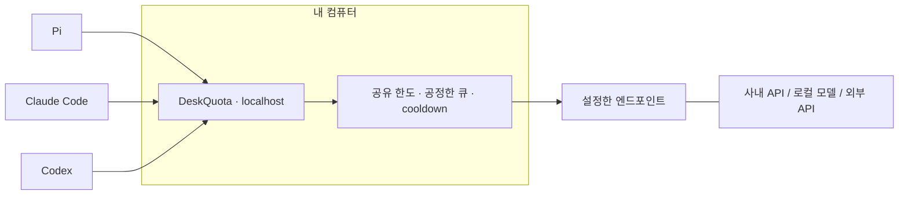

<p align="center">
  
</p>

<h1 align="center">DeskQuota</h1>

<p align="center"><a href="README.md">English</a> · 한국어</p>

<p align="center">
  <strong>Get more done within your LLM limits.</strong><br>
  같은 LLM 한도 안에서 더 많은 일을.<br>
  한도를 나눠 쓰는 LLM 요청의 낭비와 대기를 줄이는 경량 게이트웨이.
</p>

<p align="center">
  <a href="#시작하기">시작하기</a> ·
  <a href="#동작-방식">동작 방식</a> ·
  <a href="#지금까지의-측정">측정 결과</a> ·
  <a href="product/docs/client-compatibility.md">클라이언트 호환성</a> ·
  <a href="RESEARCH.md">연구 기록</a>
</p>

<p align="center"><sub>Rust 코어 · 실행 파일 하나 · Docker·WSL·데이터베이스 없이 실행</sub></p>

---

## 여러 에이전트의 요청을 한곳에서 관리

한 에이전트가 리팩터링하는 동안 다른 에이전트는 리뷰를 하고 또 다른 에이전트는 짧은 답을 기다립니다.
상용·무료·사내 API의 사용 한도나 로컬 모델의 처리 용량을 함께 나눠 씁니다.

DeskQuota는 내 PC에서 도구·스크립트·에이전트와 **설정한 LLM 엔드포인트 하나** 사이에서 동작합니다.
이 인스턴스를 지나는 요청의 사용량을 통합해 관리하고 설정한 클라이언트 큐를 번갈아 처리합니다.
상위 서버가 `429`를 반환하면 요청들이 함께 대기하도록 조율합니다.

쓰던 도구를 유지하면서 공유 사용 한도를 한곳에서 관리하세요.

| 사용 중 겪는 상황 | DeskQuota의 처리 방식 |
|---|---|
| 여러 도구가 API 한도 하나를 공유 | 이 인스턴스를 지나는 요청의 RPM·TPM 공동 관리 |
| 무거운 요청과 가벼운 요청이 섞임 | 설정한 root 간 라운드로빈과 root 내 FIFO, 특정 요청이 계속 밀리는 현상 방지 |
| 엔드포인트가 혼잡하거나 사용 제한에 걸림 | 크기가 제한된 대기열, 사용 제한 시 공동 대기, 명시적인 재시도 한도 |
| 작업을 취소함 | 대기 중인 요청 취소와 상위 서버 연결의 수명 관리 |
| 사내 프록시나 별도 CA가 필요함 | TLS 검증을 유지하는 명시적 연결 설정 |
| 업무를 시작하고 마침 | 터미널 설정 마법사, `on`·`off`·상태 조회, 사용자 로그인 시 자동 시작 여부 선택 |

**초기 개발 단계입니다.** macOS ARM64 패키지와 일부 클라이언트 흐름을 검증했습니다.
Windows 10 x64 PC 한 대에서도 GNU 빌드, 테스트 404개, ZIP 설치, 설정 마법사,
개발 도구를 PATH에서 제외한 실행 검증을 통과했습니다.
Claude Code 2.1.76의 자동 연결 설정과 실제 파일 읽기 도구 호출도 통과했습니다.
Windows 클라이언트 설정 파일 교체가 간헐적으로 실패하는 문제는 아직 남아 있습니다.
검증 범위와 남은 문제는 [Windows 후속 보고서](reports/windows-followup-and-improvements-2026-09-16.md)에 정리했습니다.
Linux 실행 검증과 실제 제공자 API를 사용한 성능 비교는 아직 남아 있습니다.
프로젝트 이름은 DeskQuota이며, 현재 실행 명령은 **`llmgw`**입니다.

## 시작하기

### 실행 파일로 설치

[v0.1.0-preview.1](https://github.com/ryuwon-ai/deskquota/releases/tag/v0.1.0-preview.1)에서
macOS ARM64 또는 Windows x64 아카이브, 설치 스크립트, 각각의 `.sha256` 파일을 받으세요.
[체크섬 검증·설치 안내](product/docs/installation.md)를 따라 설치한 뒤
`llmgw setup`, `llmgw on`을 실행합니다. 컴파일러·Docker·WSL은 필요하지 않습니다.

게시자 서명이 없는 사전 릴리스입니다(macOS는 임시 서명만 포함).
운영체제와 회사의 보안 정책을 따라야 하며, 서명과 새 PC의 보안 정책 통과 여부는 아직 검증하지 않았습니다.

이번 패키지는 두 플랫폼의 CI를 통과했습니다. Windows MSVC 실행 파일은
Windows 10 실기기에서 설치를 검증한 뒤 PATH를 비운 상태로 실행했고, 별도 VC/GNU 런타임 DLL 의존성이 없음을 확인했습니다.
정확한 파일과 검사 범위는 [릴리스 검증 기록](reports/native-preview-release-2026-09-16.md)에 정리했습니다.
설치 검증이며 실제 제공자 API의 성능 측정 결과는 아닙니다.

### 소스에서 설치

빌드하려면 Rust 도구 모음이 필요합니다. 설치한 게이트웨이를 실행할 때는
Rust·Python·Node·Redis·Docker·WSL이 필요하지 않습니다.

macOS에서 저장소 루트를 기준으로 실행합니다.

```sh
cd product
CARGO_TARGET_DIR="$HOME/.cache/deskquota/cargo" cargo install --locked --path .
llmgw setup
```

빌드 결과물은 소스 폴더 밖에 저장됩니다. Cargo 실행 파일 디렉터리가 `PATH`에 포함되어 있어야 합니다.
[설치 안내](product/docs/installation.md)에서 오프라인 아카이브 전달과 선택적 BPE 빌드 방법도 확인할 수 있습니다.

### 내 환경에 맞게 설정

설정 마법사에서 로컬·사내·외부 API 엔드포인트와 지원 API 형식, 모델 ID,
인증정보 참조, RPM·TPM 한도, 동시 실행 수를 설정합니다.
설정을 적용하기 전에 변경 내용을 보여줍니다. 클라이언트 연결과 로그인 시 자동 시작도
각각 변경 내용을 먼저 확인할 수 있습니다.

로컬 게이트웨이가 적용할 한도를 선택하세요.

| 한도 선택 | 의미 |
|---|---|
| 숫자 | 최근 60초의 RPM·TPM을 로컬에서 제한 |
| `unknown` | 로컬 한도를 추가하지 않고 제공자에게 맡김. 실제 제공자 한도는 미확인 |
| `unlimited` | 로컬 RPM·TPM 제한을 두지 않겠다는 명시적 선택 |

어떤 항목을 선택해도 동시 실행 수와 공유 `429` 대기는 유지됩니다.
제공자가 한도를 연속 보충하는데 같은 숫자를 로컬 60초 제한으로 입력하면 불필요한 대기가
생길 수 있습니다. 별도의 로컬 예산을 지켜야 한다면 숫자 한도를 유지하세요.
`unknown`이 개인별 할당량을 따로 보장해 주지는 않습니다.

```sh
llmgw on        # 백그라운드 게이트웨이 시작
llmgw status    # 상태 확인
llmgw off       # 게이트웨이 종료
```

설정을 바꾸려면 `llmgw setup`을 실행하세요. `llmgw doctor`로는 네트워크 호출 없이 설정을 점검합니다.
저장한 설정을 실행 중인 프로세스에 적용하려면 `llmgw restart`를 사용합니다.

> **도구를 연결하기 전에:** 도구의 LLM 기본 URL이 로컬 게이트웨이를 가리키게 됩니다.
> 기존 제공자에 직접 연결했을 때와 모델 목록·기능 표시가 다를 수 있습니다.
> DeskQuota는 변경할 클라이언트 설정 파일과 키를 미리 보여줍니다.
> 게이트웨이를 끄더라도 클라이언트 설정은 남습니다. 관리 중인 값을 복원하려면
> `disconnect`를 사용하세요. [설정 변경 범위](product/docs/client-compatibility.md)를 확인해 주세요.

## 동작 방식



상위 서버는 각 클라이언트가 사용하는 API 형식을 지원해야 합니다.
DeskQuota는 설정한 경로로 요청을 전달합니다. Completions·Messages·Responses 형식을
서로 변환하거나 모델을 내려받아 직접 실행하지는 않습니다.

기본 설정에서 OpenAI 형식 경로의 예는 `http://127.0.0.1:4141/r/pi-work/v1`입니다.
Messages 클라이언트에는 끝의 `/v1`을 제외한 기본 URL을 사용합니다.
마법사에서 클라이언트별 정확한 URL을 확인할 수 있습니다.

클라이언트의 표준 API 키 인증을 그대로 사용합니다. `auth.mode = "forward"`이면
`Authorization`이나 `x-api-key`를 전달하며, 별도 `X-LLMGW-Token`은 필요 없습니다.
서비스는 로컬 주소에서만 연결을 받고, 종료·상태 조회용 인증은 별도로 유지합니다.
시작 시 대기 시간은 `startup_hold_secs = 60`이 기본값이며, 0으로 끄거나 조절할 수 있습니다.

### 쓰던 도구 연결하기

| 클라이언트 | 검증한 버전 | 검증한 프로토콜 | 모델 목록 지원 범위 |
|---|---|---|---|
| Pi | 0.84.2 | Chat Completions | 명시적으로 설정한 모델 목록 표시와 모델 선택 검증 |
| Claude Code | 2.1.76 | Messages | 이 연결 프로필에서 자동 탐색 미지원 |
| Codex | 0.154.0 | HTTP 기반 Responses | 게이트웨이의 모델 목록이 곧 Codex 카탈로그는 아님 |

**테스트용 모의 서버를 사용한 이전 macOS ARM64 테스트**입니다.
파일 읽기 도구 호출과 후속 요청까지 검증했습니다. 전용 data token 제거 후에는 Pi 0.84.2의
일반 응답·파일 읽기 흐름을 로컬 모의 서버와 upstream auth `none`으로 다시 확인했습니다.
Claude·Codex의 변경한 프로필은 로컬 계약 검사로 확인했으며 전체 실행 결과는 이전 증거입니다.
모든 버전과 모델 기능, 실제 코딩 작업의 성공을 보장하지는 않습니다.
[설정 파일 변경과 검증한 흐름 →](product/docs/client-compatibility.md)

Pi·Codex·Claude Code의 자동 요약과 이후 대화는 격리한 실제 CLI 검사에서 통과했습니다.
Windows의 Claude도 확인했습니다. 다만 `/responses/compact`는 아직 지원하지 않으며,
TPM 한도를 설정하면 암호화된 압축 항목이나 추정 예약량이 설정한 한도를 넘는 요청은 거절됩니다.
긴 작업에 사용하기 전 [자동 압축 검증 결과와 남은 한계](reports/auto-compaction-audit-2026-09-16.md)를 확인해 주세요.

## 작게 유지하는 설계

실행 파일 하나로 동작하며 메모리에서 요청을 스케줄링합니다. 대기열과 스트림 버퍼의 크기를 제한하고
상위 서버 연결을 재사용합니다. 응답은 조각이 도착하는 대로 전달합니다.

선택형 exact cache는 반복 요청에 완결된 짧은 텍스트 응답을 재사용합니다.
설정 마법사에서 켜거나 `[cache]`에 `ttl_secs = 300`, `max_history = 3`을 지정하면 됩니다.
`llmgw status`에서 캐시 정책을 평가한 요청 수, hit, 캐시 대상 요청의 miss와 제외 이유,
항목 수와 보관 용량을 확인할 수 있습니다.
캐시 데이터는 4 MiB로 제한하며, hit는 상위 서버의 사용 한도를 소비하지 않습니다.
캐시를 사용하면 새로 생성한 답변 대신 이전 답변을 받습니다.
SDK의 `x-stainless-retry-count`만 달라진 요청은 같은 캐시 항목을 사용합니다.
서버가 `Vary`로 이 헤더에 따라 응답이 달라진다고 명시하면 저장하지 않습니다.
인증정보, 나머지 유효 헤더, 본문 바이트가 다르면 여전히 항목을 구분합니다.

**`develop`에 반영된 동작:** 캐시 대상인 동일 요청이 동시에 들어오면 빈 실행 슬롯이
있어도 하나만 보내고 응답을 공유합니다. 첫 요청은 그대로 스트리밍하며, 나머지는
사용 한도나 실행 슬롯을 소비하지 않고 완결된 응답을 기다립니다. 첫 요청이 실패하거나
취소되거나 캐시에 저장할 수 없으면 다음 요청이 이어받습니다. 따라서 뒤따르는 요청의
첫 토큰 도착은 늦어질 수 있습니다. `status`는 중복 응답 대기와 일반 입장 대기를 구분합니다.
배포된 `v0.1.0-preview.1`에는 이 중복 병합과 아래 서킷 브레이커가 포함되지 않았습니다.

같은 root·모델·인증 범위에서 해당하는 장애가 60초 이내 간격으로 세 번 이어지면,
서킷 브레이커가 5초 동안 추가 호출을 막습니다. 차단을 유발한 응답의 유효한 재시도
대기 시간이 더 길면 그만큼 기다립니다. 캐시 히트는 계속 제공하며, 다른 요청에는
`503 upstream_circuit_open`과 `Retry-After`를 반환합니다. 시간이 지나면 실제 요청
하나로 복구를 확인합니다. 백그라운드 생성 호출이나 다른 모델로의 자동 변경은 없습니다.
클라이언트 오류와 `429`는 장애 횟수에 넣지 않으며, 응답 본문 단계의 타임아웃도
느린 클라이언트의 영향일 수 있어 제외합니다. 추적 범위는 최대 128개입니다. 추적할
자리가 없는 새 범위도 기존 사용 한도와 동시성 제한은 그대로 적용받습니다.

TPM 한도를 지정한 경우, 종료된 upstream 시도의 예약량과 관측된 사용량도 상태에서 비교합니다.
usage 누락은 별도로 집계합니다. 이 수치는 예약량의 차이를 설명하며 정확한 토큰 예측 오차나
제공자의 잔여 한도를 뜻하지 않습니다. 대기열에는 현재의 대표적인 자원 병목과 보호 중인 root가
표시됩니다. 누적 수치는 게이트웨이 프로세스를 재시작하면 초기화됩니다.

기본 macOS 실행 파일은 **59.92MB에서 10.20MB로 약 83% 줄었습니다**.
바이트 추정을 사용하며 BPE 사전을 포함하지 않습니다.
필요하면 `--features bpe`로 빌드할 수 있으며, 이 경우에도 별도 서비스 없이
같은 명령어를 사용하는 실행 파일 하나로 동작합니다.
이 빌드에서는 TPM 한도를 아는 모델에 `cl100k_base` 또는 `o200k_base`를 직접 선택해
바이트 기준의 과도한 예약을 줄일 수 있습니다. 먼저 제공자가 사용하는 인코딩을
확인하고, 해당 모델의 기존 `[[models]]` 항목에 다음 설정을 추가하세요.

```toml
input_estimator = "cl100k_base"
input_token_overhead = 32
```

원본 JSON 전체를 BPE로 계산한 뒤 서버 형식에 필요한 여유분을 더합니다.
**제공자의 정확한 입력 토큰 수나 보장된 상한은 아닙니다.** OpenAI 호환 URL이라고
같은 토크나이저를 쓰는 것도 아닙니다. 요청 본문과 출력 상한은 그대로 전달합니다.
기본값인 `utf8_bytes`는 추가 여유분을 0으로 설정해야 합니다. macOS 게이트웨이에서
측정한 유휴 RSS는 **바이트 모드 약 9.9MiB, cl100k 약 41.7MiB, o200k 약 76.7MiB**였습니다.
현재 BPE 포함 빌드는 **59.92MB**이며, TPM 한도를 지정한 경우 선택한 사전만
초기화합니다. 기본 빌드에서 BPE 설정을 쓰면 새 프로세스를 시작하거나 설정을
저장하기 전에 오류를 알립니다. 추정 방식을 자동으로 바꾸지는 않으며,
기존 프로세스의 상태 확인과 종료는 계속 가능합니다.
이 패키징 변경이 BPE 사전의 실행 중 메모리 사용량을 줄여 주는 것은 아닙니다.
[입력 추정의 측정 결과와 한계 →](reports/input-estimation-results-2026-09-16.md)

기본 정책은 특정 요청이 계속 밀리지 않도록 하는 라운드로빈입니다.
실험 중인 backfill 정책은 보호 대상 요청의 조건부 실행 기회를 유지하면서
작은 요청이 남는 용량을 사용할 수 있는지 확인합니다.
`bench-harness` 기능으로 구분된 실험 코드이며 **기본 정책이 아닙니다.**

현재 동작 범위와 한계는 다음과 같습니다.

- 인스턴스 하나는 자신을 지나는 트래픽만 관리합니다. 다른 PC가 공유 한도를 얼마나 사용하는지는 파악하지 못합니다.
- 사용량 추정은 제공자의 제한 정책과 정확히 같지 않습니다. 기본값은 요청 바이트 수이며, 모델별로 BPE 인코딩과 추가 토큰 여유분을 선택할 수 있습니다. 기본값인 `actual` 정산은 지원되는 JSON·스트리밍 응답의 유효한 최종 usage로 예약량을 보정하며,
  usage가 없으면 예약을 유지합니다. 제공자의 요청 허용 기준과 보고된 사용량은 다를 수 있습니다.
- 스케줄링으로 불필요한 대기를 줄일 수 있지만 제공자의 사용 한도를 늘리거나 원격 모델의 토큰 생성을
  일시 정지했다가 재개할 수는 없습니다.
- 의미 기반 캐시, 자동 모델 라우팅, 프롬프트 재작성은 구현하지 않았습니다.
  Exact cache는 도구 호출, 상태를 참조하는 요청, 미완성 응답을 저장하지 않습니다.

[런타임·사용 한도 동작 규칙 →](product/docs/runtime-contract.md)

## 지금까지의 측정

아래 수치는 **Apple M4·32 GiB RAM** 환경에서 측정했습니다.
저사양 PC에서도 같은 결과가 나온다고 보장할 수는 없습니다.

원본 18건을 **RPM 한도가 연속 보충되는 모의 서버**에서 전후 5쌍 비교했습니다.
기존의 제공자 위임 설정을 선택하자 요청별 완료 시간의 p95가 **38.13초에서 2.51초**로 줄었습니다.
양쪽 모두 **90/90건 완료·upstream 90회**를 유지했습니다. 짧은 입력 그룹의 평균은
**3.76→1.21초**, 도착 간격을 포함한 전체 배치 완료 시간은 **67.59→31.96초**였습니다.
제공자 정책과 다르게 추가된 로컬 60초 제한을 없앤 효과입니다. 새 스케줄러로 얻은
성능이나 제공자 한도 증가를 뜻하지 않습니다. 실제로 최근 60초의 요청 수를 제한하는
서버에서는 모두 완료하기까지 긴 대기가 남았습니다. 별도의 로컬 예산을 지켜야 한다면
숫자 한도를 유지하세요. 두 측정 설정 모두 시작 대기를 껐으므로,
기본 startup hold 60초는 위 시간에 포함되지 않습니다.

앞선 패키지 검사에서 기본 실행 파일은 **macOS 10.20 MB / Windows 16.38 MB**였으며, 이 Mac에서 측정한 유휴 메모리는
**9.67 MiB**였습니다. macOS 기본·BPE 빌드는 **각 456개 검사**, Windows는 **기본 409개·BPE 관련 236개 검사**를 통과했습니다.
같은 검사가 겹치므로 고유 검사 수로 합산하지 않습니다. 재시도 금지, 설정, 시작·종료,
자동 요약도 문서에 명시한 플랫폼별 범위에서 확인했습니다.
[작업 완료 시간·경쟁 대조·빌드 검증·트레이드오프 →](reports/workflow-completion-and-lightweight-builds-2026-09-16.md)

이번 `develop` 변경에서는 빈 실행 슬롯이 있어도 캐시 대상인 동일 요청을 하나로 합칩니다.
동시성 3에서 동일 요청 10건의 상위 서버 호출은 **3회 → 1회**로 줄었고 완료 시간은 거의 같았습니다.
중복 8건이 먼저 도착한 뒤 별개 요청 2건을 넣은 실험에서는 호출이 **5회 → 3회**,
요청부터 완료까지의 p95가 **217 → 123ms**로 줄었습니다. 각 조건을 전후 5쌍 비교했고,
양쪽 모두 조건별 **50/50건**을 완료했습니다. 모의 서버의 응답 지연은 100ms입니다.
작은 합성 실험이므로 실제 서비스의 꼬리 지연이나 모델 속도 개선으로 해석하지 않습니다.
캐시를 끈 무대기 대조군은 p95 **0.418 → 0.425ms**, p99 **0.444 → 0.512ms**였고,
macOS 실행 파일은 **40,608바이트** 늘었습니다. 함께 추가한 서킷브레이커는 반복 장애가
발생한 상위 서버로의 요청을 잠시 차단합니다. 빠른 거절도 성공이 아닌 실패로 집계합니다.
[중복 병합·서킷브레이커·원시 결과·트레이드오프 →](reports/cache-circuit-improvements-2026-09-16.md)

앞선 대기 중 캐시 재사용 변경에서는 동시성1에서 동일한 JSON·스트리밍 요청10건의
upstream 호출이 **10회에서 1회로 줄었습니다**(전후5쌍, 모두10건 완료).
JSON은 모의 서버의 응답 gate를 연 뒤 완료까지의 p95가 **1,029→104ms**였습니다.
실행5회의 중앙값이며 모의 생성 지연100ms를 포함합니다.
RPM1에서도750ms의 클라이언트 마감 안에 완료한 수가 **1/10→10/10건**으로 늘었습니다.
동시성3에서는 이미 시작한3건이 남았고, 서로 다른 요청·캐시OFF 대조군은10회를 유지했습니다.
완료된 응답을 재사용한 효과이며 모델 생성 속도가 빨라진 것은 아닙니다.
캐시OFF 무대기 p95의 중앙값은 **0.345→0.359ms**, 유휴 RSS는 **약10MiB**였습니다.
Windows 네이티브 계약 검사도 통과했으며, 실제 제공자·저사양 환경의 성능 우위는 아직 미확인입니다.
[대기 중 캐시 재사용·429 전달·트레이드오프·교차 검토 →](reports/efficiency-improvements-and-debate-2026-09-16.md)

`cl100k_base`를 직접 선택한 TPM 제한 합성 실험을 전후 각각 3회 반복했습니다.
요청당 대기 한도 1.5초 안에 완료한 수는 혼합 burst에서 **10/12 → 12/12건**,
입력 이력이 누적되는 순차 호출에서 **4/6 → 6/6건**으로 늘었고 upstream 429는 없었습니다.
기존 18건 실험의 p95는 **40.63초에서 38.13초로 줄었으며**, 최종 완료 18건과
첫 1분 완료 16건은 그대로였습니다. 여유분을 더 준 별도 대조 1회에서도 입력을
과소 예약하지 않고 같은 p95를 유지했습니다. 다만 burst의 성공 평균 시간은 늘었고,
토큰 계산 계약이 맞지 않는 반례에서는 429가 발생했습니다. 선택한 모드의 대기 감소를
확인한 결과이며, 모든 요청의 지연 개선이나 새로운 경쟁 제품 비교는 아닙니다.
대기가 없는 큰 요청의 p95는 약 0.37ms에서 1.06ms로 늘었습니다.
[전후 비교·반례·자원 비용 →](reports/input-estimation-results-2026-09-16.md)

앞선 진단 기능 추가와 함께 캐시 miss 원인 하나를 줄였습니다. SDK의 재시도 횟수 헤더만
다른 두 요청을 보냈을 때, JSON·스트리밍 모두 upstream 호출이 **2회에서 1회로 줄었습니다.**
해당 헤더를 `Vary`에 명시한 대조군은 2회를 유지했습니다. 합성 요청 재실행 검사이며,
실제 SDK의 재시도 흐름이나 사내 hit rate를 측정한 결과는 아닙니다.
[진단 기능과 현재 release 검증](reports/quota-diagnostics-2026-09-15.md)

일반 JSON 응답의 usage 정산을 추가한 뒤, 작은 TPM 한도의 합성 실험에서
750ms의 클라이언트 대기 한도 내 완료가 **5/20건에서 20/20건으로 늘었습니다**
(전후 각각 5회 반복). 예약을 유지하는 설정과 usage 누락 대조군은 양쪽 모두 5/20건이었습니다.
무대기 p95는 양쪽 약 0.263ms였고, 의존성 추가 없이 실행 파일이 1,184바이트 늘었습니다.
로컬 대기 감소를 확인한 결과이며, 일반적인 처리량 배수나 제공자 한도 증가를 뜻하지 않습니다.

진단 기능 추가 전 exact-cache 검사에서 hit p95는 **JSON 0.60ms / 스트리밍 0.72ms**였습니다
(각 30개 표본). 모의 서버에 50ms 지연을 넣고 요청 120건 중 절반을 의도적으로 반복해
upstream 호출 60회를 생략했습니다. 로컬 재사용 효과를 확인한 결과이며 실제 hit rate나
모델 속도를 측정한 것은 아닙니다.
[최신 경쟁 비교와 캐시 측정](reports/current-competitor-comparison-2026-09-15.md)
[JSON 정산 구현과 전후 대조군](reports/competitor-round2-2026-09-15.md)
[이전 사내 피드백 반영과 캐시 측정](reports/company-feedback-2026-09-15.md)

진단 기능 추가 전 RR/actual release를 Bifrost transport v2.1.1, 고정한 HiveMind HEAD,
LiteLLM v1.100.1과 다시 비교했습니다. 실행 순서를 바꿔 제품별로 순차 요청 100건을
5회씩 보냈을 때 DeskQuota의 **p95는 0.433–0.556ms, 유휴 RSS는 9.56–9.66MiB**로
세 비교 구성보다 낮았습니다. 모든 제품이 500/500건을 완료했습니다. 캐시를 끄고 대기가
없는 로컬 모의 환경에서 얻은 수치이며, 새로 공개된 LiteLLM v1.101.0은 실행하지 않았습니다.
별도 제한 실험에서는 DeskQuota가 대기 후 18/18건을 완료했고, 첫 60초 완료는 16건으로
Direct·Bifrost·HiveMind와 같았습니다. 거절·긴 대기와 설정 차이까지
[전체 비교 보고서](reports/current-competitor-comparison-2026-09-15.md)에 담았습니다.

이전 측정은 별도로 보존합니다.

| 관찰 항목 | 기록된 결과 | 측정 범위 |
|---|---|---|
| 유휴 메모리 | **RSS 9.73 MiB** | 인수 검증을 마친 macOS 패키지, 10개 표본 |
| 시작 / 종료 | **36–63 ms / 36–45 ms** | 로컬 5회; 첫 요청 준비 시간이 아닌 프로세스 수명 주기 |
| 짧은 요청 평균 | **14.72초 → 12.32초** | 실험용 backfill과 자체 RR 기본 정책, 합성 비교 5쌍 |
| 짧은 요청 p95 | **약 47초 → 약 47초** | 같은 실험에서 개선 관찰 없음 |
| 측정창 안의 완료 수 | **55 → 55** | 정책별 60초 측정창 5개; 처리량 증가 관찰 없음 |

backfill의 평균 시간에는 측정창이 끝난 뒤 대기 중인 요청을 마저 처리한 시간도 포함됩니다.
정책별 100개 요청을 제출해 85개가 완료되고 15개는 의도적으로 취소됐습니다.
짧은 요청 그룹에는 모델 목록 조회도 포함됩니다.
다섯 번 모두 같은 작업 구성에서 요청 도착 시점만 조금씩 바꿔 반복했습니다. 서로 독립적인 다섯 종류의 작업을 비교한 결과는 아닙니다.

이 시간에는 사용 한도 때문에 대기한 시간과 상위 서버의 응답 시간이 포함됩니다.
**게이트웨이 자체 처리 오버헤드가 14초라는 뜻은 아닙니다.**

2026-09-15에는 Bifrost·HiveMind·LiteLLM의 버전을 고정해 같은 Mac에서 비교했습니다.
무대기 조건에서 순차 요청을 100개씩 3회 보냈을 때 DeskQuota 실험용 RR 바이너리의 p95는
0.394–1.229 ms, 유휴 RSS는 8.78–8.84 MiB였습니다. 메모리 관측값은 비교한 구성보다 작았지만
p95가 매번 더 낮지는 않았습니다.

별도로 큐가 막힌 상황을 재현한 한 쌍의 검사에서는 실험용 backfill의 모델 목록 조회 시간이
52.02초에서 13.77ms로 줄었고 보호된 요청은 두 경우 모두 첫 quota 만료 시점에 실행됐습니다.
이 결과를 일반적인 성능 향상으로 해석할 수는 없습니다. 해당 동작은 실험 기능으로 남겨뒀습니다.

새 생성 입력에서는 18개 중 RR이 16개, backfill이 15개를 완료했습니다. 이 반례를 보존하고
기본 정책은 RR로 유지합니다. 실제 API 성능 우위는 아직 확인하지 못했습니다.
[이전 경쟁 구현 비교와 전체 조건](reports/competitor-comparison-results-2026-09-15.md)에서
실행별 집계와 설정에 따른 차이를 확인할 수 있습니다.

[패키지 인수 검증 측정치](product/artifacts/native-final-integration-package/acceptance/README.md) ·
[Backfill 결과와 원시 기록](reports/backfill-experiment-results.md) ·
[벤치마크 방법](product/docs/benchmark-method.md)

## 다음 단계

- 사용 한도와 공정성 규칙을 지키면서 모델 목록 조회의 불필요한 대기를 줄이기
- 실제 엔드포인트의 사용량 계산 기준에 맞춰 요청 사용량 추정 검증하기
- 서로 독립적인 작업 구성을 비교하고 NVIDIA 호스팅 API 호환성 검사하기
- 실제 작업에서 캐시 적용률과 중복 병합의 한도 절약·첫 토큰 대기 비용을 측정하기
- 실제 API의 한도 정책에서 제공자에 제한을 맡기는 방식과 로컬 예산을 지키는 방식의 완료 시간·트레이드오프 검증
- Windows 일반 사용자 계정·Pi·실제 로그인 자동 시작을 추가 검증하고, Linux와 더 낮은 사양의 PC에서도 확인하기

간단히 재현할 수 있는 사례가 큰 도움이 됩니다. 설정한 한도와 클라이언트 버전,
기대한 동작, 실제 결과를 함께 남겨 주세요.
인증정보, 사내 URL, 프롬프트, 비공개 소스 코드는 공유 자료에 포함하지 마세요.

## 더 살펴보기

아래 문서 중 일부는 영문입니다.

| 문서 | 내용 |
|---|---|
| [설치 안내](product/docs/installation.md) | 네이티브 설정, 로컬 아카이브, 시작과 종료 |
| [클라이언트 호환성](product/docs/client-compatibility.md) | 모델 표시와 되돌릴 수 있는 설정 변경 |
| [런타임 동작 규칙](product/docs/runtime-contract.md) | 큐, 사용 한도, 스트리밍, 취소 동작 |
| [연구 기록](RESEARCH.md) | 구현 과정, 검증 근거, 남은 질문 |
| [참조 자료 목록](reports/reference-catalog.md) | 버전을 고정해 분석한 게이트웨이·에이전트·추론 엔진 |
| [최근 스케줄링 연구](reports/recent-scheduling-evidence-2026-09-14.md) | 논문의 연구 결과와 HTTP 게이트웨이에 적용할 수 있는 범위 |

## 라이선스

프로젝트 원본 코드는 Rust 패키지에 명시된 대로 [MIT](LICENSE-MIT) 또는
[Apache-2.0](LICENSE-APACHE) 라이선스를 선택해 사용할 수 있습니다.
외부 참조 자료에는 각각의 라이선스가 적용됩니다. [공개 스냅샷 범위](docs/publication-snapshot.md)를 참고하세요.

---

<p align="center"><sub>내 작업을 이어 가는, 조금 더 조용한 대기열.</sub></p>
