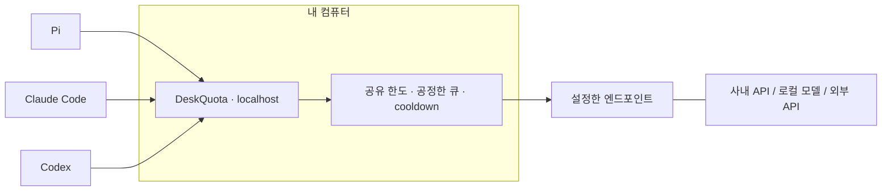

<p align="center">
  
</p>

<h1 align="center">DeskQuota</h1>

<p align="center"><a href="README.md">English</a> · 한국어</p>

<p align="center">
  <strong>Your LLM quota, managed at your desk.</strong><br>
  내 책상에서 관리하는 LLM 사용 한도.<br>
  사용 한도가 있는 LLM 엔드포인트를 함께 쓰는 코딩 에이전트를 위한 가벼운 네이티브 게이트웨이.
</p>

<p align="center">
  <a href="#시작하기">시작하기</a> ·
  <a href="#동작-방식">동작 방식</a> ·
  <a href="#지금까지의-측정">측정 결과</a> ·
  <a href="product/docs/client-compatibility.md">클라이언트 호환성</a> ·
  <a href="RESEARCH.md">연구 기록</a>
</p>

<p align="center"><sub>Rust 코어 · 실행 파일 하나 · Docker·WSL·데이터베이스 없이 실행</sub></p>

---

## 여러 에이전트의 요청을 한곳에서 관리

한 에이전트가 리팩터링하는 동안 다른 에이전트는 리뷰를 하고 또 다른 에이전트는 짧은 답을 기다립니다.
모두 같은 사내 API 사용 한도나 로컬 모델 서버를 나눠 씁니다.

DeskQuota는 내 PC에서 코딩 도구와 **설정한 LLM 엔드포인트 하나** 사이에서 동작합니다.
이 인스턴스를 지나는 요청의 사용량을 통합해 관리하고 설정한 클라이언트 큐를 번갈아 처리합니다.
상위 서버가 `429`를 반환하면 요청들이 함께 대기하도록 조율합니다.

쓰던 도구를 유지하면서 공유 사용 한도를 한곳에서 관리하세요.

| 사용 중 겪는 상황 | DeskQuota의 처리 방식 |
|---|---|
| 여러 도구가 API 한도 하나를 공유 | 이 인스턴스를 지나는 요청의 RPM·TPM 공동 관리 |
| 무거운 요청과 가벼운 요청이 섞임 | 설정한 root 간 라운드로빈과 root 내 FIFO, 특정 요청이 계속 밀리는 현상 방지 |
| 엔드포인트가 혼잡하거나 사용 제한에 걸림 | 크기가 제한된 대기열, 사용 제한 시 공동 대기, 명시적인 재시도 한도 |
| 작업을 취소함 | 대기 중인 요청 취소와 상위 서버 연결의 수명 관리 |
| 사내 프록시나 별도 CA가 필요함 | TLS 검증을 유지하는 명시적 연결 설정 |
| 업무를 시작하고 마침 | 터미널 설정 마법사, `on`·`off`·상태 조회, 사용자 로그인 시 자동 시작 여부 선택 |

**초기 개발 단계입니다.** macOS ARM64 패키지와 일부 클라이언트 흐름을 검증했습니다.
Windows·Linux에서의 실행 검증과 실제 제공자 API를 사용한 성능 비교는 아직 남아 있습니다.
프로젝트 이름은 DeskQuota이며, 현재 실행 명령은 **`llmgw`**입니다.

## 시작하기

### 소스에서 설치

빌드하려면 Rust 도구 모음이 필요합니다. 설치한 게이트웨이를 실행할 때는
Rust·Python·Node·Redis·Docker·WSL이 필요하지 않습니다.

macOS에서 저장소 루트를 기준으로 실행합니다.

```sh
cd product
CARGO_TARGET_DIR="$HOME/.cache/deskquota/cargo" cargo install --locked --path .
llmgw setup
```

빌드 결과물은 소스 폴더 밖에 저장됩니다. Cargo 실행 파일 디렉터리가 `PATH`에 포함되어 있어야 합니다.
아직 바이너리 릴리스나 온라인 설치 스크립트는 공개하지 않았습니다.
[설치 안내](product/docs/installation.md)에는 별도로 전달받은 아카이브의 체크섬 검증 방법도 있습니다.

### 내 환경에 맞게 설정

설정 마법사에서 로컬·사내·외부 API 엔드포인트와 지원 API 형식, 모델 ID,
인증정보 참조, RPM·TPM 한도, 동시 실행 수를 설정합니다.
설정을 적용하기 전에 변경 내용을 보여줍니다. 클라이언트 연결과 로그인 시 자동 시작도
각각 변경 내용을 먼저 확인할 수 있습니다.

```sh
llmgw on        # 백그라운드 게이트웨이 시작
llmgw status    # 상태 확인
llmgw off       # 게이트웨이 종료
```

설정을 바꾸려면 `llmgw setup`을 실행하세요. `llmgw doctor`로는 네트워크 호출 없이 설정을 점검합니다.
저장한 설정을 실행 중인 프로세스에 적용하려면 `llmgw restart`를 사용합니다.

> **도구를 연결하기 전에:** 도구의 LLM 기본 URL이 로컬 게이트웨이를 가리키게 됩니다.
> 기존 제공자에 직접 연결했을 때와 모델 목록·기능 표시가 다를 수 있습니다.
> DeskQuota는 변경할 클라이언트 설정 파일과 키를 미리 보여줍니다.
> 게이트웨이를 끄더라도 클라이언트 설정은 남습니다. 관리 중인 값을 복원하려면
> `disconnect`를 사용하세요. [설정 변경 범위](product/docs/client-compatibility.md)를 확인해 주세요.

## 동작 방식



상위 서버는 각 클라이언트가 사용하는 API 형식을 지원해야 합니다.
DeskQuota는 설정한 경로로 요청을 전달합니다. Completions·Messages·Responses 형식을
서로 변환하거나 모델을 내려받아 직접 실행하지는 않습니다.

기본 설정에서 OpenAI 형식 경로의 예는 `http://127.0.0.1:4141/r/pi-work/v1`입니다.
Messages 클라이언트에는 끝의 `/v1`을 제외한 기본 URL을 사용합니다.
마법사에서 클라이언트별 정확한 URL을 확인할 수 있습니다.

### 쓰던 도구 연결하기

| 클라이언트 | 검증한 버전 | 검증한 프로토콜 | 모델 목록 지원 범위 |
|---|---|---|---|
| Pi | 0.84.2 | Chat Completions | 명시적으로 설정한 모델 목록 표시와 모델 선택 검증 |
| Claude Code | 2.1.63 | Messages | 이 연결 프로필에서 자동 탐색 미지원 |
| Codex | 0.154.0 | HTTP 기반 Responses | 게이트웨이의 모델 목록이 곧 Codex 카탈로그는 아님 |

**테스트용 모의 서버를 사용한 격리된 macOS ARM64 테스트**입니다.
파일 읽기 도구 호출과 후속 요청까지 검증했습니다. 모든 버전과 모델 기능을 검증한 것은 아니며
실제 코딩 작업의 성공까지 보장하지는 않습니다.
[설정 파일 변경과 검증한 흐름 →](product/docs/client-compatibility.md)

## 작게 유지하는 설계

실행 파일 하나로 동작하며 메모리에서 요청을 스케줄링합니다. 대기열과 스트림 버퍼의 크기를 제한하고
상위 서버 연결을 재사용합니다. 응답은 조각이 도착하는 대로 전달합니다.

기본 정책은 특정 요청이 계속 밀리지 않도록 하는 라운드로빈입니다.
실험 중인 backfill 정책은 보호 대상 요청의 조건부 실행 기회를 유지하면서
작은 요청이 남는 용량을 사용할 수 있는지 확인합니다.
`bench-harness` 기능으로 구분된 실험 코드이며 **기본 정책이 아닙니다.**

현재 동작 범위와 한계는 다음과 같습니다.

- 인스턴스 하나는 자신을 지나는 트래픽만 관리합니다. 다른 PC가 사내 공유 한도를 얼마나 사용하는지는 파악하지 못합니다.
- 사용량 추정은 제공자의 제한 정책과 정확히 같지 않습니다. 현재는 요청 바이트 수로 입력 사용량을
  추정합니다. 응답에 보고된 사용량과 제공자가 요청을 허용할 때 적용하는 기준도 서로 다를 수 있습니다.
- 스케줄링으로 불필요한 대기를 줄일 수 있지만 제공자의 사용 한도를 늘리거나 원격 모델의 토큰 생성을
  일시 정지했다가 재개할 수는 없습니다.
- 응답 캐시, 의미 기반 캐시, 자동 모델 라우팅, 프롬프트 재작성은 구현하지 않았습니다.

[런타임·사용 한도 동작 규칙 →](product/docs/runtime-contract.md)

## 지금까지의 측정

아래 수치는 **Apple M4·32 GiB RAM** 환경에서 측정했습니다.
저사양 PC에서도 같은 결과가 나온다고 보장할 수는 없습니다.

| 관찰 항목 | 기록된 결과 | 측정 범위 |
|---|---|---|
| 유휴 메모리 | **RSS 9.73 MiB** | 인수 검증을 마친 macOS 패키지, 10개 표본 |
| 시작 / 종료 | **36–63 ms / 36–45 ms** | 로컬 5회; 첫 요청 준비 시간이 아닌 프로세스 수명 주기 |
| 짧은 요청 평균 | **14.72초 → 12.32초** | 실험용 backfill과 자체 RR 기본 정책, 합성 비교 5쌍 |
| 짧은 요청 p95 | **약 47초 → 약 47초** | 같은 실험에서 개선 관찰 없음 |
| 측정창 안의 완료 수 | **55 → 55** | 정책별 60초 측정창 5개; 처리량 증가 관찰 없음 |

backfill의 평균 시간에는 측정창이 끝난 뒤 대기 중인 요청을 마저 처리한 시간도 포함됩니다.
정책별 100개 요청을 제출해 85개가 완료되고 15개는 의도적으로 취소됐습니다.
짧은 요청 그룹에는 모델 목록 조회도 포함됩니다.
다섯 번 모두 같은 작업 구성에서 요청 도착 시점만 조금씩 바꿔 반복했습니다. 서로 독립적인 다섯 종류의 작업을 비교한 결과는 아닙니다.

이 시간에는 사용 한도 때문에 대기한 시간과 상위 서버의 응답 시간이 포함됩니다.
**게이트웨이 자체 처리 오버헤드가 14초라는 뜻은 아닙니다.**
아직 경쟁 게이트웨이 대비 속도 우위나 실제 API 성능을 입증하지 못했습니다.

[패키지 인수 검증 측정치](product/artifacts/native-final-integration-package/acceptance/README.md) ·
[Backfill 결과와 원시 기록](reports/backfill-experiment-results.md) ·
[벤치마크 방법](product/docs/benchmark-method.md)

## 다음 단계

- 사용 한도와 공정성 규칙을 지키면서 모델 목록 조회의 불필요한 대기를 줄이기
- 실제 엔드포인트의 사용량 계산 기준에 맞춰 요청 사용량 추정 검증하기
- 서로 독립적인 작업 구성을 비교하고 NVIDIA 호스팅 API 호환성 검사하기
- Windows·Linux와 더 낮은 사양의 PC에서 실제 실행 검증하기

간단히 재현할 수 있는 사례가 큰 도움이 됩니다. 설정한 한도와 클라이언트 버전,
기대한 동작, 실제 결과를 함께 남겨 주세요.
인증정보, 사내 URL, 프롬프트, 비공개 소스 코드는 공유 자료에 포함하지 마세요.

## 더 살펴보기

아래 문서 중 일부는 영문입니다.

| 문서 | 내용 |
|---|---|
| [설치 안내](product/docs/installation.md) | 네이티브 설정, 로컬 아카이브, 시작과 종료 |
| [클라이언트 호환성](product/docs/client-compatibility.md) | 모델 표시와 되돌릴 수 있는 설정 변경 |
| [런타임 동작 규칙](product/docs/runtime-contract.md) | 큐, 사용 한도, 스트리밍, 취소 동작 |
| [연구 기록](RESEARCH.md) | 구현 과정, 검증 근거, 남은 질문 |
| [참조 자료 목록](reports/reference-catalog.md) | 버전을 고정해 분석한 게이트웨이·에이전트·추론 엔진 |
| [최근 스케줄링 연구](reports/recent-scheduling-evidence-2026-09-14.md) | 논문의 연구 결과와 HTTP 게이트웨이에 적용할 수 있는 범위 |

## 라이선스

프로젝트 원본 코드는 Rust 패키지에 명시된 대로 [MIT](LICENSE-MIT) 또는
[Apache-2.0](LICENSE-APACHE) 라이선스를 선택해 사용할 수 있습니다.
외부 참조 자료에는 각각의 라이선스가 적용됩니다. [공개 스냅샷 범위](docs/publication-snapshot.md)를 참고하세요.

---

<p align="center"><sub>내 작업을 이어 가는, 조금 더 조용한 대기열.</sub></p>
