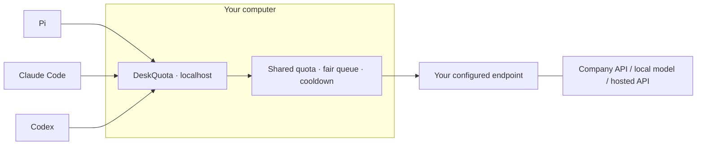

<p align="center">
  
</p>

<h1 align="center">DeskQuota</h1>

<p align="center">English · <a href="README.ko.md">한국어</a></p>

<p align="center">
  <strong>Get more done within your LLM limits.</strong><br>
  A lightweight gateway that coordinates LLM requests around shared limits.
</p>

<p align="center">
  <a href="#get-started">Get started</a> ·
  <a href="#how-it-works">How it works</a> ·
  <a href="#measured-so-far">Measurements</a> ·
  <a href="product/docs/client-compatibility.md">Client compatibility</a> ·
  <a href="RESEARCH.md">Research</a>
</p>

<p align="center"><sub>Rust core · One executable · No Docker, WSL, or database required</sub></p>

---

## A little order for a busy desk

One agent is refactoring. Another is reviewing. A third is waiting for a small answer.
They all share an API allowance or a local model's capacity—whether the endpoint
is paid, free, or provided by your company.

DeskQuota sits on your computer, between your tools, scripts, agents and **one configured
LLM endpoint**. It keeps a shared local quota ledger, gives configured client
queues their turn, and coordinates waiting when the upstream returns `429`.

Keep your tools. Put their shared limits in one place.

| At your desk | DeskQuota handles |
|---|---|
| Several tools, one API allowance | Shared RPM/TPM accounting for requests through this instance |
| Large requests beside small ones | Round-robin turns across configured roots, FIFO within each root, and starvation protection |
| A busy or rate-limited endpoint | Bounded waiting, shared cooldown, and explicit retry limits |
| A task you no longer need | Queued cancellation and controlled upstream connection lifetimes |
| Company proxy or custom CA | Explicit transport settings with TLS verification kept on |
| Starting and stopping your workday | Terminal setup, `on`, `off`, status, and optional user-login startup |

**Early development.** The macOS ARM64 package and selected client flows have
been exercised. On one Windows 10 x64 host, the GNU build, 404 tests, ZIP
installer, setup wizard, and runtime with development tools removed from PATH
passed. Claude Code 2.1.76 also passed managed connection and a native Read tool
flow. See the [Windows follow-up](reports/windows-followup-and-improvements-2026-09-16.md)
for remaining client and platform limits, including an intermittent Windows
client-settings file replacement failure. Linux and real-provider performance comparisons remain unverified.
The command is currently **`llmgw`**; DeskQuota is the project name.

## Get started

### Build from this checkout

A Rust toolchain is needed to build. The installed gateway itself needs no Rust,
Python, Node, Redis, Docker, or WSL runtime.

From the repository root, on macOS:

```sh
cd product
CARGO_TARGET_DIR="$HOME/.cache/deskquota/cargo" cargo install --locked --path .
llmgw setup
```

The build directory stays outside your checkout. Make sure Cargo's binary
directory is on your `PATH`. There is no public binary release or hosted install
script yet; the [installation guide](product/docs/installation.md) also covers
checksum-verified archives delivered separately.

### Make it yours

The setup wizard walks through your local, company, or hosted endpoint; supported
API format; model IDs; authentication reference; RPM/TPM limits; and concurrency.
It previews changes before applying them. Client connections and login startup
have their own previews.

```sh
llmgw on        # Start the background gateway
llmgw status    # Inspect its state
llmgw off       # Stop the gateway
```

Run `llmgw setup` to revisit configuration, `llmgw doctor` for an offline check,
and `llmgw restart` to apply a saved configuration to the running worker.

> **Before connecting a tool:** its base URL will point to your local gateway.
> Model discovery and capabilities can differ from the tool's usual provider.
> DeskQuota previews the exact client file and keys it will change. Stopping the
> gateway leaves those client settings in place; use `disconnect` to restore
> managed values. See [what changes](product/docs/client-compatibility.md).

## How it works



The upstream must support the API format each client uses. DeskQuota passes
requests through their configured routes; it does not translate between
Completions, Messages, and Responses or download and run a model for you.

A setup-default OpenAI-style route looks like
`http://127.0.0.1:4141/r/pi-work/v1`. Messages clients use the corresponding
base without the trailing `/v1`. The wizard shows the exact URL for each client.

Use your client's standard API-key authentication. With `auth.mode = "forward"`,
DeskQuota forwards `Authorization` or `x-api-key`; no `X-LLMGW-Token` is needed.
The worker binds only to loopback and keeps lifecycle controls separately authenticated.
New configurations use `accounting = "actual"` to settle valid final usage
from supported JSON and streaming responses. `startup_hold_secs = 60` is configurable, including 0 to disable the hold.

### Connect the tools you already use

| Client | Exercised version | Exercised protocol | Model-list boundary |
|---|---|---|---|
| Pi | 0.84.2 | Chat Completions | Explicit model list and selection verified |
| Claude Code | 2.1.76 | Messages | Automatic discovery unsupported in this profile |
| Codex | 0.154.0 | Responses over HTTP | Gateway model listing is not a Codex catalog |

These are **earlier isolated macOS ARM64 tests with a synthetic upstream**,
including a file-read tool call and follow-up request. After removing the custom
data token, Pi 0.84.2's completion and read-tool flows passed again with a local
fixture and upstream auth `none`. Claude/Codex's updated profiles have local
contract checks; their full native flows remain earlier evidence. These tests
do not certify every version, model capability, or real-world coding task.
[Exact setup, file changes, and tested flows →](product/docs/client-compatibility.md)

Automatic summarization and the next turn passed isolated native tests for
Pi, Codex and Claude Code, including Claude on Windows. There are still limits:
`/responses/compact` is unsupported, and known-TPM inspection rejects opaque
compaction inputs and oversized byte estimates. See the
[automatic compaction audit](reports/auto-compaction-audit-2026-09-16.md) before relying on long sessions.

## Small by design

One executable. In-memory scheduling. Bounded queues and stream buffers.
Connections are reused and response chunks are forwarded as they arrive.

Optional exact caching reuses complete short text responses for repeated calls.
Enable it in setup or add `[cache]` with `ttl_secs = 300` and `max_history = 3`.
It uses a fixed 4 MiB payload budget and spends no upstream quota on a hit.
Reusing a result means you receive the earlier answer rather than a fresh sample.
`llmgw status` shows cache-policy evaluations, hits, eligible misses and named
exclusions alongside entries and retained bytes. SDK `x-stainless-retry-count`
alone does not split cache entries; a response that declares `Vary` on that
header is not stored. Credentials, other effective headers and body bytes still
separate entries.

Status also compares reservations with observed usage for finished upstream
attempts under a known TPM limit. Missing usage is counted separately. These
totals explain reservation differences; they are not an exact tokenizer or a
provider balance. Queue status shows a representative current resource blocker
and any protected root. Counters reset when the worker restarts.

The default policy is round robin with starvation protection. An experimental
backfill policy tests whether smaller requests can use available capacity while
preserving a protected request's conditional admission opportunity. It remains
behind the `bench-harness` feature and is **not the default**.

Some boundaries are deliberate:

- One instance accounts for its own traffic. Other PCs can consume a shared
  allowance outside its view.
- Quota estimates are not an exact copy of every provider's limiter. The current
  in-flight input estimate uses request bytes. Valid final usage from supported JSON and streaming responses corrects
  the reservation by default; missing usage retains it. Provider admission
  rules may differ from reported usage.
- Scheduling can reduce avoidable waiting. It does not increase your provider's
  quota or pause and resume a remote model's token generation.
- Semantic caching, automatic model routing, and prompt rewriting are not
  implemented. Exact caching skips tools, stateful requests and incomplete responses.

[Runtime and quota contract →](product/docs/runtime-contract.md)

## Measured so far

Numbers are useful when their boundaries are visible. These are local
observations on an **Apple M4 with 32 GiB RAM**, not low-end hardware guarantees.

The current diagnostics update also removes a specific cache miss: two otherwise
identical requests with different SDK retry-count metadata used **one upstream
call instead of two**, for both JSON and streaming responses. A matching `Vary`
control still used two. These are synthetic reruns, not a measured SDK retry
workflow or company hit rate.
[Diagnostics update and current release checks →](reports/quota-diagnostics-2026-09-15.md)

Adding JSON usage reconciliation improved completions from **5/20 to 20/20**
in a small-TPM fixture with a 750 ms client deadline, across five paired runs.
Reserved accounting and missing-usage controls stayed at 5/20 on both versions.
No-wait p95 was approximately 0.263 ms on both; the release binary grew by 1,184 bytes,
with no new dependencies. This demonstrates local admission behavior, not a general
throughput multiplier or a provider quota increase.

The pre-diagnostics exact-cache check recorded **0.60 ms JSON / 0.72 ms streaming hit p95**
(30 samples each). It deliberately repeated half of 120 gateway requests,
avoiding 60 upstream calls against a fixture with a 50 ms delay. This verifies
local reuse, not real-world hit rate or model speed.
[Current comparison and cache measurements →](reports/current-competitor-comparison-2026-09-15.md)
[JSON accounting implementation and paired controls →](reports/competitor-round2-2026-09-15.md)
[Earlier field changes and cache measurements →](reports/company-feedback-2026-09-15.md)

A comparison of the pre-diagnostics RR/actual release used Bifrost
transport v2.1.1, HiveMind's pinned HEAD, and LiteLLM v1.100.1. Across five rotated
runs of 100 sequential requests per arm, DeskQuota recorded **0.433–0.556 ms p95**
and **9.56–9.66 MiB idle RSS**, below those three tested configurations. All arms
completed 500/500 requests. This is a cache-off, no-wait local fixture; LiteLLM's
new v1.101.0 was not executed. In a separate quota fixture, DeskQuota completed
18/18 after waiting, with 16 inside the first 60 seconds—the same first-window
count as Direct, Bifrost and HiveMind. Limits, rejected requests and long waits
are included in the [full comparison](reports/current-competitor-comparison-2026-09-15.md).

Earlier measurements remain separate:

| Observation | Recorded result | Scope |
|---|---|---|
| Idle memory | **9.73 MiB RSS** | Accepted macOS package, 10 samples |
| Start / stop | **36–63 ms / 36–45 ms** | 5 local cycles; process lifecycle, not first-request readiness |
| Short-request mean | **14.72 s → 12.32 s** | Experimental backfill vs our RR baseline; 5 paired synthetic runs |
| Short-request p95 | **About 47 s → about 47 s** | Same experiment; no observed improvement |
| Completions inside the measurement windows | **55 → 55** | Five 60-second windows per arm; no throughput increase |

The backfill mean includes successful requests completed during the subsequent
drain. Each arm submitted 100 requests: 85 completed and 15 were deliberately
cancelled. The short-request group includes model-list requests. These repeats
vary arrival jitter in one workload, not five independent workload families.
These seconds include quota waiting and upstream response time; they are not
measurements of the gateway's own processing overhead.

On 2026-09-15, we also ran pinned Bifrost, HiveMind, and LiteLLM versions on this
Mac. Across three repeats of 100 sequential no-wait requests, DeskQuota's
experimental RR binary recorded **0.394–1.229 ms p95** and **8.78–8.84 MiB idle
RSS**. Its observed memory use was smaller than the compared configurations;
its p95 was not lower in every repeat.

A separate paired probe of a blocked queue reduced model-list completion from
**52.02 s to 13.77 ms** in experimental backfill. The protected request still
started at the first quota-expiry opportunity in both runs. This was one
mechanism probe, and the behavior remains experimental.

A new generation-only input completed **16 of 18 requests with RR and 15 with
backfill**. We retain that counterexample and keep RR as the default. Real-API
performance superiority remains unverified.
[Earlier competitor comparison, configurations, and complete outcomes →](reports/competitor-comparison-results-2026-09-15.md)

[Accepted package measurements](product/artifacts/native-final-integration-package/acceptance/README.md) ·
[Backfill results and raw evidence](reports/backfill-experiment-results.md) ·
[Benchmark method](product/docs/benchmark-method.md)

## What comes next

- Reduce avoidable model-list waiting while preserving quota and fairness rules.
- Validate quota estimation against a real endpoint's accounting contract.
- Compare independent workloads, including NVIDIA hosted API compatibility checks.
- Reduce duplicate upstream calls during concurrent cold cache misses; verify quota and cancellation behavior.
- Extend Windows checks to a fresh non-admin account, Pi, and actual login startup; exercise Linux and lower-resource computers.

A useful contribution is a small reproducible case: the configured limits,
client version, expected behavior, and observed outcome. Please keep credentials,
company URLs, prompts, and private source code out of shared reports.

## Explore the work

| Start here | For |
|---|---|
| [Installation](product/docs/installation.md) | Native setup, local archives, and lifecycle |
| [Client compatibility](product/docs/client-compatibility.md) | Model visibility and reversible config changes |
| [Runtime contract](product/docs/runtime-contract.md) | Queue, quota, streaming, and cancellation semantics |
| [Research index](RESEARCH.md) | Implementation history, evidence, and open questions |
| [Reference catalog](reports/reference-catalog.md) | Pinned gateway, agent, and inference-engine studies |
| [Recent scheduling research](reports/recent-scheduling-evidence-2026-09-14.md) | Paper findings and what applies to an HTTP gateway |

## License

The original project code is dual-licensed under [MIT](LICENSE-MIT) or
[Apache-2.0](LICENSE-APACHE), as declared in the Rust package. Third-party
references retain their own licenses. See the [snapshot scope](docs/publication-snapshot.md).

---

<p align="center"><sub>A quieter queue for your working day.</sub></p>
