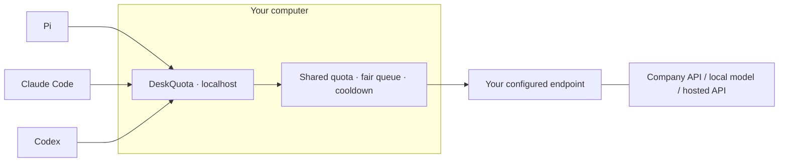

<p align="center">
  
</p>

<h1 align="center">DeskQuota</h1>

<p align="center">English · <a href="README.ko.md">한국어</a></p>

<p align="center">
  <strong>Your LLM quota, managed at your desk.</strong><br>
  A small, native gateway for coding agents sharing a limited LLM endpoint.
</p>

<p align="center">
  <a href="#get-started">Get started</a> ·
  <a href="#how-it-works">How it works</a> ·
  <a href="#measured-so-far">Measurements</a> ·
  <a href="product/docs/client-compatibility.md">Client compatibility</a> ·
  <a href="RESEARCH.md">Research</a>
</p>

<p align="center"><sub>Rust core · One executable · No Docker, WSL, or database required</sub></p>

---

## A little order for a busy desk

One agent is refactoring. Another is reviewing. A third is waiting for a small answer.
They all share the same company API limit—or the same local model server.

DeskQuota sits on your computer, between your coding tools and **one configured
LLM endpoint**. It keeps a shared local quota ledger, gives configured client
queues their turn, and coordinates waiting when the upstream returns `429`.

Keep your tools. Put their shared limits in one place.

| At your desk | DeskQuota handles |
|---|---|
| Several tools, one API allowance | Shared RPM/TPM accounting for requests through this instance |
| Large requests beside small ones | Round-robin turns across configured roots, FIFO within each root, and starvation protection |
| A busy or rate-limited endpoint | Bounded waiting, shared cooldown, and explicit retry limits |
| A task you no longer need | Queued cancellation and controlled upstream connection lifetimes |
| Company proxy or custom CA | Explicit transport settings with TLS verification kept on |
| Starting and stopping your workday | Terminal setup, `on`, `off`, status, and optional user-login startup |

**Early development.** The macOS ARM64 package and selected client flows have
been exercised. Windows/Linux runtime validation and real-provider performance
comparisons are still ahead. The command is currently **`llmgw`**; DeskQuota is
the project name.

## Get started

### Build from this checkout

A Rust toolchain is needed to build. The installed gateway itself needs no Rust,
Python, Node, Redis, Docker, or WSL runtime.

From the repository root, on macOS:

```sh
cd product
CARGO_TARGET_DIR="$HOME/.cache/deskquota/cargo" cargo install --locked --path .
llmgw setup
```

The build directory stays outside your checkout. Make sure Cargo's binary
directory is on your `PATH`. There is no public binary release or hosted install
script yet; the [installation guide](product/docs/installation.md) also covers
checksum-verified archives delivered separately.

### Make it yours

The setup wizard walks through your local, company, or hosted endpoint; supported
API format; model IDs; authentication reference; RPM/TPM limits; and concurrency.
It previews changes before applying them. Client connections and login startup
have their own previews.

```sh
llmgw on        # Start the background gateway
llmgw status    # Inspect its state
llmgw off       # Stop the gateway
```

Run `llmgw setup` to revisit configuration, `llmgw doctor` for an offline check,
and `llmgw restart` to apply a saved configuration to the running worker.

> **Before connecting a tool:** its base URL will point to your local gateway.
> Model discovery and capabilities can differ from the tool's usual provider.
> DeskQuota previews the exact client file and keys it will change. Stopping the
> gateway leaves those client settings in place; use `disconnect` to restore
> managed values. See [what changes](product/docs/client-compatibility.md).

## How it works



The upstream must support the API format each client uses. DeskQuota passes
requests through their configured routes; it does not translate between
Completions, Messages, and Responses or download and run a model for you.

A setup-default OpenAI-style route looks like
`http://127.0.0.1:4141/r/pi-work/v1`. Messages clients use the corresponding
base without the trailing `/v1`. The wizard shows the exact URL for each client.

### Connect the tools you already use

| Client | Exercised version | Exercised protocol | Model-list boundary |
|---|---|---|---|
| Pi | 0.84.2 | Chat Completions | Explicit model list and selection verified |
| Claude Code | 2.1.63 | Messages | Automatic discovery unsupported in this profile |
| Codex | 0.154.0 | Responses over HTTP | Gateway model listing is not a Codex catalog |

These are **isolated macOS ARM64 tests with a synthetic upstream**, including a
file-read tool call and follow-up request. They do not certify every version,
model capability, or real-world coding task.
[Exact setup, file changes, and tested flows →](product/docs/client-compatibility.md)

## Small by design

One executable. In-memory scheduling. Bounded queues and stream buffers.
Connections are reused and response chunks are forwarded as they arrive.

The default policy is round robin with starvation protection. An experimental
backfill policy tests whether smaller requests can use available capacity while
preserving a protected request's conditional admission opportunity. It remains
behind the `bench-harness` feature and is **not the default**.

Some boundaries are deliberate:

- One instance accounts for its own traffic. Other PCs can consume a shared
  company allowance outside its view.
- Quota estimates are not an exact copy of every provider's limiter. The current
  input estimate uses request bytes; reported usage and provider admission
  rules are different things.
- Scheduling can reduce avoidable waiting. It does not increase your provider's
  quota or pause and resume a remote model's token generation.
- Response caching, semantic caching, automatic model routing, and prompt
  rewriting are not implemented.

[Runtime and quota contract →](product/docs/runtime-contract.md)

## Measured so far

Numbers are useful when their boundaries are visible. These are local
observations on an **Apple M4 with 32 GiB RAM**, not low-end hardware guarantees.

| Observation | Recorded result | Scope |
|---|---|---|
| Idle memory | **9.73 MiB RSS** | Accepted macOS package, 10 samples |
| Start / stop | **36–63 ms / 36–45 ms** | 5 local cycles; process lifecycle, not first-request readiness |
| Short-request mean | **14.72 s → 12.32 s** | Experimental backfill vs our RR baseline; 5 paired synthetic runs |
| Short-request p95 | **About 47 s → about 47 s** | Same experiment; no observed improvement |
| Completions inside the measurement windows | **55 → 55** | Five 60-second windows per arm; no throughput increase |

The backfill mean includes successful requests completed during the subsequent
drain. Each arm submitted 100 requests: 85 completed and 15 were deliberately
cancelled. The short-request group includes model-list requests. These repeats
vary arrival jitter in one workload, not five independent workload families.
These seconds include quota waiting and upstream response time; they are not
measurements of the gateway's own processing overhead. There is no demonstrated
competitor-gateway speed advantage or real-API performance result yet.

[Accepted package measurements](product/artifacts/native-final-integration-package/acceptance/README.md) ·
[Backfill results and raw evidence](reports/backfill-experiment-results.md) ·
[Benchmark method](product/docs/benchmark-method.md)

## What comes next

- Reduce avoidable model-list waiting while preserving quota and fairness rules.
- Validate quota estimation against a real endpoint's accounting contract.
- Compare independent workloads, including NVIDIA hosted API compatibility checks.
- Exercise Windows, Linux, and lower-resource computers before claiming support.

A useful contribution is a small reproducible case: the configured limits,
client version, expected behavior, and observed outcome. Please keep credentials,
company URLs, prompts, and private source code out of shared reports.

## Explore the work

| Start here | For |
|---|---|
| [Installation](product/docs/installation.md) | Native setup, local archives, and lifecycle |
| [Client compatibility](product/docs/client-compatibility.md) | Model visibility and reversible config changes |
| [Runtime contract](product/docs/runtime-contract.md) | Queue, quota, streaming, and cancellation semantics |
| [Research index](RESEARCH.md) | Implementation history, evidence, and open questions |
| [Reference catalog](reports/reference-catalog.md) | Pinned gateway, agent, and inference-engine studies |
| [Recent scheduling research](reports/recent-scheduling-evidence-2026-09-14.md) | Paper findings and what applies to an HTTP gateway |

## License

The original project code is dual-licensed under [MIT](LICENSE-MIT) or
[Apache-2.0](LICENSE-APACHE), as declared in the Rust package. Third-party
references retain their own licenses. See the [snapshot scope](docs/publication-snapshot.md).

---

<p align="center"><sub>A quieter queue for your working day.</sub></p>
