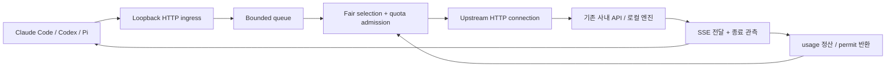

# 로컬 quota 게이트웨이 설계 초안

상태: **과거 초안 — 2026-09-12 사용자 승인과 추가 요구를 반영한 [최신 명세](2026-09-12-local-quota-gateway-design.md)로 대체됨**. 작성일 2026-09-11. 요구사항은 [README](../../../README.md), 근거는 [저장소 분석](../../../reports/repository-analysis.md)과 [문헌 검토](../../../reports/literature-review.md)에 있다.

## 풀려는 문제

한 PC에서 agent 여러 개가 하나의 제한된 LLM API를 사용한다. 각자 동시에 요청하고 재시도하면 quota를 낭비하고, 긴 요청 뒤에서 짧은 요청이 오래 기다린다. 사용자는 서버 엔진을 바꾸기 어려우며 Docker·WSL도 사용할 수 없을 수 있다.

제품의 목표는 **같은 모델·같은 작업·같은 quota에서 성공한 작업을 늘리고 불필요한 대기와 재시도를 줄이는 것**이다. prompt를 몰래 줄이거나 모델을 바꿔 속도를 얻지 않는다. Rust 자체의 proxy 비용과 스케줄링의 효과는 따로 측정한다.

## 접근법과 추천

1. LiteLLM/Bifrost 설정 또는 extension: 가장 빠른 baseline. 우리 설치·원문 전달 요구를 충족하면 이것으로 충분할 가능성도 검증한다.
2. **추천: Rust 네이티브 로컬 gateway**. quota admission, bounded fair queue, 제한된 retry, 원문 stream/cancel이라는 작은 코어를 만든다.
3. 엔진 scheduler 수정: token-level 선점과 KV 이동을 할 수 있지만 사내 API 최적화의 첫 제품으로는 부적합하다.

## 첫 완성 범위

| 포함 | 경계 |
|---|---|
| 정해진 upstream으로 HTTP/SSE 전달 | 동일 API 형식만. JSON request/response를 다른 provider 형식으로 변환하지 않음 |
| quota 단위의 RPM·token admission | quota 산정 계약을 명시. 추정값과 관측값 구분 |
| bounded queue와 공정한 선택 | agent/session 간 입장 순서. 실행 중 추론을 선점하지 않음 |
| 동시 실행 cap | 원격 API와 로컬 엔진에 각각 설정. stream 종료까지 점유 |
| 429·일시 오류 처리 | 전체 deadline과 시도 횟수 안에서, 재실행 가능성이 확인된 경우만 |
| 원인별 최소 관측 | queue 시간, upstream 시간, retry, 완료/실패/취소. 내용 로그 기본 비활성 |

첫 비교에서 cache 없이도 이득을 입증할 수 있게 한다. exact response cache는 별도 opt-in 실험으로 남긴다. semantic cache, prompt 압축, 모델 대체, MCP 실행, agent orchestration, billing, 대시보드, 모델 프로세스 실행/교체는 현재 코어에 넣지 않는다.

## 데이터 흐름과 모듈

- **Transport**: 연결 재사용, HTTP framing, backpressure, streaming, disconnect. 요청 본문은 제한된 크기로 한 번만 확보해 read-only로 필요한 필드를 관찰하고 원래 bytes를 전송한다. 응답 전체를 버퍼링하지 않는다. hop-by-hop headers 등 HTTP 전달에 필요한 변경은 protocol translation과 구분한다.
- **Admission**: 한 quota/resource group의 큐·quota ledger·동시성 점유를 소유한다. 필요한 시각의 timer와 완료/취소 이벤트로 깨어나며 주기적 busy polling을 하지 않는다.
- **Observation**: 별도 파싱으로 가능한 usage·limit header를 읽는다. 파싱 불가를 0 사용량으로 만들지 않는다. 기록 경로는 bounded이며 사용자 payload를 저장하지 않는다.

검증된 async/HTTP 라이브러리를 사용한다. 구체 crate와 버전은 구현 계획에서 manifest·문서·Windows 동작을 확인한 뒤 고정한다. 현재 workspace에는 제품 의존성을 추가하지 않았다.

## 공정성과 자원 비용

v0 baseline은 root session 사이 round robin, session 안에서는 FIFO로 시작한다. 다음 후보는 추정 token 비용을 차감하고 완료 시 정산하는 deficit 방식이다. 동일 예제에서 token fairness·짧은 p95·긴 작업 대기·총 완료량을 비교한 뒤 최종 정책을 선택한다. 어느 쪽도 GPU token scheduler의 수학적 보장을 가진다고 주장하지 않는다.

root session은 명시된 설정/힌트로 식별한다. 같은 작업이 만든 자식 agent는 root 예산을 공유한다. 힌트가 없는 도구는 설정된 하나의 group으로 동작하며 내부 agent별 공정성을 보장하지 않는다. 임의 header를 신뢰하면 ID를 많이 만드는 쪽이 유리해질 수 있으므로 계층·weight는 로컬 설정에 묶고 header 값은 식별 힌트로만 쓴다. 실제 도구의 힌트 주입 가능성은 E2E로 확인한다.

[Pi 0.84.2의 실제 CLI 조사](../../../reports/client-integration-validation.md)에서는 기본 Completions 요청에 검사한 세션 헤더가 없었다. 사용자 설정 header는 전달됐고, affinity 옵션을 켜면 `session_id`, `x-client-request-id`, `x-session-affinity`가 같은 값을 담았다. 이 값은 세션 식별 힌트이지 요청마다 유일한 중복 제거 key가 아니다. 도구 연동 설정에서 root 관계와 논리 요청 ID를 혼동하지 않는다.

요청별로 **할당량 비용**과 **실행 자원 비용**을 분리한다. RPM은 요청 수, TPM은 provider 규칙에 따른 token, 로컬 slot은 실행 점유다. token 한 개의 비용을 모든 모델·장치에서 같은 GPU 시간으로 취급하지 않는다.

큰 요청이 일시적으로 token 잔량에 맞지 않을 때 작은 요청을 무한히 우회시키면 기아가 생긴다. 기아 반례를 포함해 제한된 우회/예약을 비교한다. 예약은 유휴 시간을 만들 수 있으므로 무조건 켜 두는 최적화로 취급하지 않는다. quota 계약상 절대 수용 불가능한 요청은 즉시 설명하고, 단순 추정 오차로 큰 요청을 영구 거절하지 않게 검사한다.

원본 Overlaat로 [직접 재현](../../../reports/reference-validation.md)한 결과, heavy → heavy → light에서는 비용 0.25가 남아 있어도 light가 기다리고 heavy → light → heavy에서는 입장했다. 두 순서 모두를 정책 수용 조건에 넣는다. 이 관측으로 우리 기본 정책이 확정된 것은 아니다.

**동시 실행이 1이고 긴 추론이 이미 실행 중이라면 새 짧은 요청의 대기는 피할 수 없다.** 게이트웨이가 줄일 수 있는 것은 그 뒤의 잘못된 입장 순서와 중복 실행이다.

## quota·재시도 계약

URL 별칭이나 API key 개수만으로 독립 quota라고 추정하지 않는다. 실제 공유 quota를 설정에서 같은 group으로 묶는다. 외부 직원·다른 PC가 같은 quota를 쓰는 경우 로컬 장부는 전체 사용량을 알지 못한다. 응답 header는 관측 시점의 정보이고, out-of-order 응답이나 진행 중 요청이 있어 마지막 header를 그대로 전역 잔량으로 덮어쓰지 않는다.

공식 API 규칙에 따라 admission 시 차감량과 완료 시 usage 정산을 다르게 처리한다. Azure식 max_tokens 예약과 Claude식 실제 출력 사용량을 하나의 무조건 환급 규칙으로 합치지 않는다. unknown usage는 보수적으로 남기되 만료·다음 reset 규칙을 명시해 영구 잠금을 만들지 않는다. 내용에서 token 수를 대략 추정할 때 오차를 함께 측정하고 필요한 tokenizer만 선택적으로 도입한다.

명시적 rate-limit 429에는 Retry-After/해당 provider의 ms header를 반영해 group의 다음 admission 시각을 늦춘다. header가 없으면 제한된 exponential backoff와 jitter를 사용하되, spend-cap·인증·불가능한 요청은 자동 retry 대상으로 삼지 않는다. 각 시도는 같은 quota 장부를 지나며 retry 대기 중에는 실행 슬롯을 점유하지 않는다.

자동 retry는 upstream이 작업을 수락하지 않았음을 알 수 있는 오류 등 확인된 경우로 한정한다. 연결이 끊겨 수락 여부가 불명확한 POST, 이미 시작한 stream, 임의 503을 무조건 replay하지 않는다. client의 자체 retry와 겹칠 때 시도 횟수를 곱으로 늘리지 않게 도구별 설정과 실제 시도 수를 기록한다. 성공을 보장할 수 없는 지속 과부하에서는 제한된 큐와 deadline 뒤에 명확한 오류를 반환한다.

설치된 Pi의 기본 429는 총 4회 요청으로 관측됐고, content 뒤 정상 종료 표시가 없을 때도 다시 호출했다. gateway가 내부 replay를 하지 않는 것만으로 작업 전체의 중복 생성이 사라지지는 않는다. 비교 arm마다 재시도 소유자를 명시하며 client 기본 설정과의 조합도 확인한다. client가 Retry-After 이전에 새 요청을 보내면 같은 group의 admission 제약을 적용한다.

## 취소와 종료

상태는 `queued -> admitted -> upstream_started -> streaming -> terminal`이다. 종료 이유는 completed, rejected, upstream_error, deadline, client_cancelled, usage_unknown으로 구분하되 usage_unknown은 완료 결과와 별도 관측 필드로도 기록할 수 있다. 구현 시 중복 상태를 만들지 않도록 결정한다.

큐에서 취소된 요청은 upstream으로 보내지 않는다. 송신 후 취소는 upstream 연결을 닫지만 그것만으로 서버 계산 중지를 확정하지 않는다. 로컬 엔진의 abort 동작을 검증하기 전에는 “취소된 추론 비용 0”으로 계산하지 않는다. 확인되지 않은 실행의 점유를 언제 풀지, drain 가능한지, 최대 보수적 유지 시간을 어떻게 둘지는 엔진별 smoke test로 확정한다.

stream chunk 사이의 Unicode·JSON·SSE frame 분할을 허용한다. body의 첫 byte, 첫 SSE event, 첫 model token을 혼동하지 않는다. 종료·오류·취소 경합에서 permit과 quota 예약은 한 번만 정리한다. 재시작 시 in-flight 작업을 몰래 재전송하지 않는다.

취소·stream 수명은 실제 소켓으로 검증한다. 원본 reference의 직접 iterator 종료 테스트는 통과했지만 TCP no-abort 정책은 자연 EOF 전 점유를 반환했다. transport task의 취소가 이미 upstream iterator를 닫은 뒤에는 `finally`에 drain 코드를 두는 것만으로 점유 보존을 보장할 수 없다는 검증 과제로 남긴다.

## 네이티브 설치와 낮은 사양

기본안은 Rust 실행 파일 + 작은 설정 파일 + 메모리 상태다. Python/Node는 benchmark·도구 integration에 사용해도 된다. Redis는 허용된 선택지지만 로컬 단일 프로세스의 기본 의존성으로는 이득이 확인되지 않았다. [공식 설치 문서](https://redis.io/docs/latest/operate/oss_and_stack/install/)는 Windows의 Docker 경로와 Memurai partner preview를 안내한다(2026-09-11 확인). Redis를 Windows에서 절대 실행할 수 없다고 단정하지 않되, Docker/WSL 금지 환경의 기본 의존성으로 요구하지 않는다. 저장이 꼭 필요해지면 embedded 저장소부터 기존 라이브러리를 검토한다.

상한이 있는 request body·큐·stream 관측 buffer, 재사용하는 HTTP pool, event 기반 대기를 우선한다. 모든 prompt를 tokenizer/embedding 모델에 다시 보내거나 매 요청마다 파일·Redis에 동기 기록하지 않는다. 동시 요청 수를 올리는 것을 효율 개선으로 간주하지 않고 backend의 실제 cap과 맞춘다.

Windows에서는 관리자 권한 없는 실행, 공백/한글 경로, Ctrl-C 종료, OS/corporate CA, proxy, 절전 후 복귀를 검증한다. TLS 검증을 끄는 설정으로 사내 인증서 문제를 해결하지 않는다. 바이너리 배포 시점에 백신·서명·배포 정책을 확인한다. 현재 Mac에서 이 항목들을 통과했다고 주장하지 않는다.

## 검증과 다음 결정

[벤치마크 명세](../../../reports/benchmark-spec.md)를 구현 계획의 입력으로 삼는다. 단순 baseline을 이기지 못하면 정책을 추가하기 전에 측정과 문제 정의를 재검토한다. 공개 mock의 요청 처리 개선, 실제 agent task 개선, 사내 구두 피드백을 서로 다른 evidence로 유지한다.

사용자에게 확인할 핵심 결정은 **v0.1을 quota·공정 큐·retry·stream/cancel에 집중하고, 응답 캐시와 엔진 선점은 후속 실험으로 두는 범위**다. 이 결정이 확인되면 명세의 알고리즘·protocol acceptance 조건을 구체화하고 리뷰한 뒤 구현 계획으로 넘어간다.
