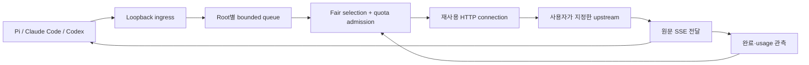

# Local quota gateway — v0.1 코어 설계

2026-09-12. 사용자의 “오케이 … 잘 설계해봐”와 네이티브 실행·초기 설정 요구를 범위 승인으로 기록한다. 제품명은 아직 정하지 않았으며 문서의 `llmgw`는 개발용 명령 이름이다. 제품 구현·성능·배포 완료를 의미하지 않는다. [이전 초안](2026-09-11-local-quota-gateway-draft.md)을 대체한다. 설치와 클라이언트 연동은 [별도 명세](2026-09-12-native-setup-design.md)로 나눈다.

## 1. 목표와 범위

한 PC의 여러 coding agent가 같은 제한된 upstream을 사용할 때 성공한 작업 수를 늘리고, 짧은 작업의 대기와 불필요한 재시도를 줄인다. 동일한 모델·prompt·출력 상한·sampling을 유지한 비교로 평가한다. 낮은 Rust proxy 비용과 quota scheduling의 효과를 따로 측정한다.

v0.1은 **프로세스 하나, upstream 하나, 공유 quota group 하나**다. 같은 upstream의 여러 모델·클라이언트를 연결한다. 클라이언트별 route가 있어도 quota는 하나다. 여러 upstream으로 자동 라우팅하는 범용 gateway는 만들지 않는다. 실제로 모델마다 quota가 독립적인 환경은 이 버전의 정밀 배분 지원 범위 밖이라고 안내한다.

| 포함 | 제외 |
|---|---|
| HTTP/SSE 동일 형식 전달, 원문 보존 | OpenAI↔Anthropic 변환, 모델 대체 |
| RPM/TPM 입장 제어, bounded queue, root별 공정 입장 | GPU token 선점, KV swap, 모델 서버 시작/교체 |
| 429 cooldown, 제한된 retry, 취소·deadline | 모호한 POST 재실행, 무한 retry |
| 네이티브 CLI, setup/on/off/status/doctor, 로그인 자동 시작 | Docker/WSL/Redis/Python/Node 필수 런타임, 웹 UI |
| 제한된 로컬 운영 지표 | payload 로그, 원격 telemetry, billing, MCP orchestration |

응답 캐시·semantic cache·prompt 압축은 첫 비교에서 제외한다. 기존 upstream의 prefix cache가 유지되도록 body와 의미 있는 헤더를 보존한다. exact cache는 품질·tool 상태·scope·stochastic sample을 따로 검증하는 후속 기능이다.

## 2. 기존 구현과 논문에서 가져온 것

근거는 [저장소 비교](../../../reports/repository-analysis.md), [최신 문헌 원문 검토](../../../reports/literature-review.md), [실행 반례](../../../reports/reference-validation.md)다. Overlaat의 예약은 요청 순서에 따라 남은 자원을 사용하지 못했다. 공정 순환은 단순 baseline으로 쓰고, 예약은 기아 방지 조건이 충족될 때만 제한한다. LMetric·LAPS·FastServe의 성능 배수는 엔진 내부 제어·대형 GPU·실험 당시 baseline의 결과라 우리 HTTP gateway에 이전하지 않는다.

**HTTP gateway는 실행 중인 추론을 KV 상태를 보존한 채 선점할 수 없다.** 동시성 1에서 긴 요청이 실행 중이면 뒤의 짧은 요청도 기다린다. 우리가 바꾸는 것은 요청 입장 순서·재시도·낭비다. CPU context switching과 동일한 보장을 제품 설명에 쓰지 않는다.

## 3. 실행 경로와 모듈 경계

| 모듈 | 소유 상태와 인터페이스 |
|---|---|
| `config` | 시작 시 검증된 immutable 설정. 실행 중 파일 watch/reload 없음. disk fingerprint 변경은 pending_restart로 표시 |
| `transport` | bounded body bytes, HTTP pool, downstream/upstream 수명. `submit(RequestMeta, Bytes)`와 terminal event 사용 |
| `admission` | queue, RPM/TPM 장부, concurrency permit의 단일 소유자. timer·enqueue·cancel·complete 이벤트로만 진행 |
| `protocol` | route 검증 및 model/출력 상한/usage 관찰. 변환·prompt 수정 없음 |
| `metrics` | counter와 bounded histogram. user text·모델별 무한 label 없음 |
| CLI/setup/lifecycle | 서버 실행 전후에만 설정·OS 등록·파일 편집. request hot path에서 호출하지 않음 |

Rust 단일 package에서 모듈로 분리한다. 별도 plugin framework·IPC broker·서비스 컨테이너는 필요 없다. HTTP·TLS·async·TOML 기능은 유지보수되는 라이브러리로 처리한다. crate 선택과 feature/MSRV 검증은 구현 계획의 첫 단계다.

## 4. URL·프로토콜·인증 계약

게이트웨이는 기본 `127.0.0.1:4141`에서 수신한다. 포트는 setup에서 변경 가능하며 충돌 시 자동으로 다른 포트로 옮기지 않는다. bind 주소는 v0.1에서 loopback으로 제한한다.

upstream 설정은 **API base**다. 예: `https://host.example/team/v1`. 클라이언트 root `pi-work`의 base는 `http://127.0.0.1:4141/r/pi-work/v1`. `/r/pi-work/v1/chat/completions`는 `/team/v1/chat/completions`로 전달한다. Claude용 base는 `/r/claude-work`로 안내해 Claude가 붙이는 `/v1/messages`가 한 번만 들어가게 한다. wizard는 입력 URL·정규화된 base·최종 예제 URL을 함께 보여준다. prefix를 버리거나 임의로 `/v1`을 중복 추가하지 않는다.

지원 endpoint는 `POST chat/completions`, `POST responses`, `POST messages`, `POST messages/count_tokens`, `GET models`다. upstream이 실제 제공하는 형식만 enable한다. Responses는 HTTP/SSE만 지원하며 WebSocket upgrade·background response 조회 등 지원 밖 경로는 upstream 송신 전에 명확히 거절한다. 통과시키지 않는 경로를 제품 호환성 안내에 열거한다. count_tokens와 models는 같은 root 큐·64개 전체 상한·동시성 cap·cooldown을 사용한다. 별도 관리 큐를 만들지 않는다. 두 endpoint의 비용은 RPM=1, generation TPM=0이고 출력 상한을 요구하지 않는다. count_tokens API 자체에 별도 token quota가 있는 upstream은 이 버전의 정확한 회계 지원 밖으로 표시한다.

body는 JSON으로 한 번 관찰하되 받은 bytes를 그대로 보낸다. SSE는 chunk 경계와 관계없이 원래 순서·bytes를 전달한다. unknown field/header는 HTTP 규칙상 제거 대상이 아니면 보존한다. `Connection`에 지목된 헤더 등 hop-by-hop, gateway 전용 헤더, upstream과 다른 Host는 적절히 제거/재작성한다. 압축·Content-Length 일관성을 보장하며 upstream redirect는 자동 추적하지 않는다. URL query는 configured base query와 요청 query를 합치되 같은 key 충돌은 거절해 인증/버전 변경을 숨기지 않는다.

모든 데이터 요청은 setup이 생성한 로컬 전용 `X-LLMGW-Token`이 필요하다. 연동기는 이 헤더를 Pi/Claude/Codex의 custom header 설정에 추가한다. 이 값은 upstream에 보내지 않는다. upstream 인증은 `forward`(기존 client 인증 유지), `env`(설정한 환경변수를 시작 시 읽어 지정한 헤더에 주입), `none` 중 하나다. env 모드는 기존 Authorization과 x-api-key를 모두 제거한 뒤 설정한 인증 헤더 하나만 주입하며 forward와 혼합하지 않는다. `Authorization`/`x-api-key`의 기존 login 충돌은 연동 단계에서 확인한다. upstream 자격 증명 원문을 새 config·로그·진단 출력·argv에 복사하지 않는다. 생성한 로컬 data token은 사용자 전용 state 파일과 명시적으로 연결한 사용자 전용 client config에 literal로 보관한다. 별도 secret helper를 매 요청 실행하지 않는다. local token도 diff·로그에서는 가리고 project 공유 파일에 쓰지 않는다. control token은 client config에 복사하지 않는다.

별도의 control token을 사용하는 loopback 관리 API만 stop/status를 수행한다. 브라우저 Origin 요청은 거절하며 data token으로 관리 API에 접근할 수 없다. 다른 로컬 프로세스와 사용자를 완전히 격리하는 보안 제품이라고 주장하지 않는다.

## 5. 공정 입장 정책

기본은 **설정에 등록된 root 간 round robin, root 안에서는 FIFO**다. root는 route에 연결되고 자식 agent는 같은 route를 물려받아 예산을 공유한다. 알 수 없는 route는 거절한다. 임의 session header로 root를 무한 생성하지 않는다. 같은 Pi 설정을 공유하는 독립 세션들은 하나의 root로 취급한다. 더 세밀한 분리가 필요하면 별도 이름의 route를 설정한다. 이는 로컬 설정의 공정성이지 악성 사용자에 대한 다중 tenant 보장이 아니다.

각 wake에서 root별 head를 한 번씩 검사한다. 모든 quota와 slot이 맞는 head를 선택하고 cursor를 다음 root로 이동한다. **입장이 확정되는 순간에만** 모든 자원을 함께 잠정 점유한다. admitted 뒤 HTTP attempt 시작 전 취소는 이 hold를 한 번 해제하고 upstream attempt/RPM 실제 사용을 늘리지 않는다. HTTP attempt가 시작되면 RPM 차감을 확정한다. 큐의 후보를 검사하는 동안 quota를 예약하지 않는다. 반복 scan으로 CPU를 태우지 않고 가장 이른 quota 시각 또는 terminal event를 기다린다.

큰 head를 우회한 횟수는 다른 요청의 실제 admission 때만 증가한다. 같은 head가 8번 우회되거나 5초 기다리면 oldest eligible head를 barrier로 잡는다. 여기서 eligible은 현재 잔량에 맞는다는 뜻이 아니라 설정된 전체 capacity 안에서 수용 가능한 유효한 요청이라는 뜻이다. 이 head가 들어갈 수 있도록 추가 작은 요청 admission을 잠시 멈춘다. cancellation·deadline·불가능한 비용이면 barrier를 제거한다. 큐에 넣을 때 원래 wait 시작 시각을 보관해 retry가 aging을 초기화하지 않게 한다. 이 상수는 검증 시작값이며 수학적 latency 보장은 아니다. 지속 과부하·외부 quota 소비·긴 실행 중에는 bounded waiting을 보장하지 않는다.

비교 후보의 token deficit scheduling은 benchmark 안에서만 구현한다. 기본 policy에 weight·priority·ML predictor를 넣지 않는다. RR보다 유효한 이득이 있고 긴 요청 완료율을 희생하지 않을 때 정책 교체를 검토한다.

## 6. Quota 모델과 TPM의 정직한 경계

RPM과 TPM은 각각 `known(value)`, `unknown`, `unlimited`를 구분한다. 값 0을 무제한으로 해석하지 않는다. 첫 입력은 TTM이 아닌 **TPM(tokens per minute)**으로 안내한다. provider의 시간창·burst·input/output/cached token 규칙을 모르면 `estimated` 상태다. wizard가 숫자 두 개만 받아 정확한 provider 회계를 알았다고 표시하지 않는다.

v0.1의 로컬 장부는 **60초 rolling window**와 동시성 cap을 사용한다. RPM은 모든 upstream HTTP attempt 시작 시 1 차감하고 만료 전 환급하지 않는다. TPM은 요청의 입력 추정량+출력 예약량을 차감한다. 출력 예약은 request의 명시된 상한, 없으면 setup에 명시한 모델 출력 상한이다. silently 상한을 request에 삽입하지 않는다. 출력 상한이 없고 TPM이 known이면 admission 전에 설명 가능한 설정 오류를 반환한다.

입력 추정의 초기 구현은 full JSON body의 UTF-8 byte 수를 token 단위의 보수적 대용치로 사용한다. 이것은 임의 tokenizer·chat template·이미지에 대한 엄밀한 상한이 아니다. **provider TPM을 정확히 준수하거나 최적 활용한다는 주장은 이 모드에서 금지한다.** 토큰 수가 fixture에 정확히 주어진 테스트에서는 exact ledger와 실제 proxy 추정 비용을 별도 arm으로 비교한다. 실제 gateway에는 테스트용 비용 header를 받지 않는다. 멀티모달 body의 비싼 base64를 token으로 처리하는 모드는 지원 밖으로 표시하고, known TPM 모드에서 거절한다. RPM/동시성만 사용하려면 사용자가 TPM을 unknown으로 명시한다.

completion usage는 추정 오차 지표로 모은다. 기본 `reserved` 계약에서는 usage가 작아도 환급하지 않는다. `actual` 계약을 명시한 환경만 terminal usage로 남은 현재-window 예약을 한 번 정산한다. input/output/cache의 산정 의미가 확인된 항목만 사용하고 missing/unknown usage는 예약량을 만료까지 유지한다. actual이 예약보다 크면 debt를 반영하고 해소될 때까지 새 입장을 막는다. 이미 만료한 예약을 뒤늦게 환급해 bucket을 부풀리지 않는다. 60초보다 긴 generation에서 발생한 usage는 관측 시각의 새 debit으로 처리하는 보수적 근사이며 정확한 server token timing은 알 수 없다고 표시한다.

재시작은 과거 in-flight를 재전송하지 않는다. known quota가 있으면 첫 admission을 해당 window 60초 뒤로 늦춰 새 프로세스가 잔량을 모두 가진 척하지 않는다. 이전 계산이 계속되거나 다른 PC가 쓰는 quota까지 막는 보장은 아니다. 절전 복귀에서도 accumulated burst 없이 quota를 재계산한다. provider header는 만료/cooldown을 더 보수적으로 만드는 데 사용하며 늦게 온 remaining 값으로 전역 잔량을 덮어쓰지 않는다.

추정 때문에 capacity 초과인 요청은 실제 token 초과라고 단정하지 않고 `estimate_exceeds_budget`와 해소 방법을 표시한다. 효율이 부족하면 먼저 정확한 tokenizer/공식 token count의 비용 대비 이득을 독립 측정한다. 요청마다 추가 LLM 호출·임베딩 호출을 넣지 않는다.

## 7. 429·retry·취소·종료

gateway 자동 retry 기본은 **0회**다. 명시적으로 gateway가 retry를 소유하도록 연동한 경우에만 rate-limit rejection에 한해 최대 1회 재시도한다. 전체 deadline은 유지하며 retry 대기 동안 실행 slot을 반환한다. 각 attempt는 같은 admission을 거친다. 429의 spend cap/insufficient quota는 영구 오류로 취급한다. 분류할 수 없는 429는 전달하고 자동 replay하지 않는다.

HTTP client 내부의 default retry도 명시적으로 끈다. Reqwest 0.13.5의 `ClientBuilder::retry(reqwest::retry::never())`를 확인했다. library retry·redirect가 admission 장부 밖에서 추가 attempt를 만들지 않는 socket fixture가 필요하다.

유효한 `Retry-After` 초/HTTP date 또는 선택한 계약의 ms header는 group cooldown으로 적용한다. deadline보다 뒤인 시각도 cooldown에서 잘라 앞당기지 않는다. 현재 요청만 deadline으로 끝낸다. 값이 없으면 첫 retry 대기는 1초+0~250ms jitter다. client가 그 전에 재요청해도 cooldown을 적용한다. 503·모호한 POST 연결 단절·이미 downstream에 시작한 stream은 자동 replay하지 않는다. client retry와 SDK retry가 별도로 존재하며, 설정만으로 논리 작업 전체 retry가 0이라고 주장하지 않는다([Pi 실측](../../../reports/client-integration-validation.md)).

상태는 `queued → admitted → upstream_started → streaming → terminal`이고 terminal reason과 usage known/unknown은 별도 필드다. permit/예약 소유권은 요청 ID별 한 번만 정리된다. queue 취소는 upstream 요청 0회, HTTP 전달 이후 취소는 backend 계산 중지 여부와 별개다.

기본 cancel 정책은 downstream을 분리한 뒤 upstream을 bounded drain하며 실행 slot을 EOF/오류/전체 deadline까지 유지하는 것이다. UI에 응답을 보내지 않아도 usage 관측과 slot 수명은 별도 worker가 소유한다. drain은 데이터를 저장하지 않는다. backend abort가 실측된 환경만 `close`를 선택하며, close 뒤 계산 종료는 별도 검증 수준으로 표시한다. off의 강제 종료 시점에는 이보다 짧은 종료 유예가 적용된다.

기본값: ingress body 최대 8 MiB, 전체 보관 request body 합 32 MiB, queued 최대 64개, root 최대 16개, 동시 실행 1개(사용자 변경 가능, 최대 16개), queue deadline 120초, 요청 전체 deadline 30분, response observer event 최대 256 KiB, stop drain 10초. body 공간은 각 chunk 보관 전에 incremental permit으로 차감하고 parse overhead도 peak RSS에서 검증한다. 추가 permit이 즉시 없으면 기다리지 않고 그 request의 부분 body와 permit을 해제한 뒤 429 `gateway_memory_full`로 거절한다. 부분 body를 가진 채 메모리 permit을 기다리는 상호 대기는 금지한다. transport 수신 chunk 자체의 메모리는 별도 bounded ingress 비용으로 측정한다. observer event가 넘치면 그 request의 usage 관측을 unknown으로 바꾸고 bytes 전달은 계속한다. HTTP ingress header 10초/body 전체 읽기 30초 timeout, 최대 header 32KiB, 동시 ingress connection 128개를 적용한다. slow sender가 자원을 영구 점유하지 않게 한다.

queue full은 protocol 형식의 429 `gateway_queue_full`, queue/overall deadline은 시작 전 504, body 초과는 413이다. stream 시작 후에는 status를 바꿀 수 없으므로 연결 종료와 로컬 원인 지표로 표시한다. queue overflow 반환은 새로운 client retry를 불러올 수 있어 비교 결과에 실제 attempts를 포함한다.

## 8. 성능 예산과 수용 조건

[벤치마크 명세](../../../reports/benchmark-spec.md)를 적용한다. 목표는 무대기 loopback 추가 p95 <2ms, idle RSS <50MiB다. **아직 달성 수치가 아니다.** setup 명령의 peak와 상주 RSS, queued body와 idle RSS를 구분한다. hot path에 파일 I/O·secret helper 실행·tokenizer 다운로드·Redis·주기적 model discovery를 넣지 않는다.

필수 반례: heavy/light 두 도착 순서, 계속되는 작은 요청 중 큰 요청, 다수 child의 root 공유, shared quota alias, late/unknown usage, server Retry-After보다 빠른 client retry, partial SSE 후 client 재요청, 느린 downstream, TCP 취소·drain gate, start/stop race, 재시작·절전, 64개 queue·큰 body, 수용 불가능한 추정 비용. 모든 outcome을 분모에 넣고 timeout을 버려 p95를 개선하지 않는다.

출시 판단은 최소 설정의 direct/FIFO/RR 및 적합한 경쟁 제품과 비교한다. useful completion 개선 또는 짧은 p95 개선을 긴 요청 완료율·총량·RSS와 함께 보고한다. exact quota fixture에서만 얻은 개선은 실제 추정-mode 우위로 홍보하지 않는다. 현재 Windows/Linux runtime, 실제 모델 task goodput, 사용자 채택, 별 수, OSS 선정은 미검증이다.
